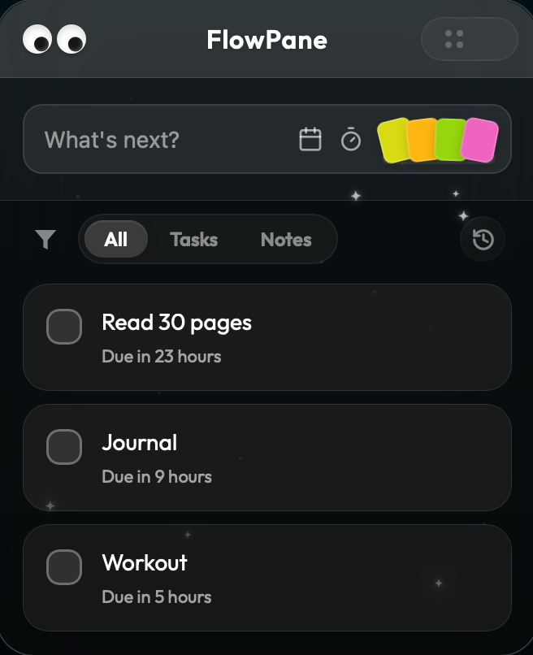
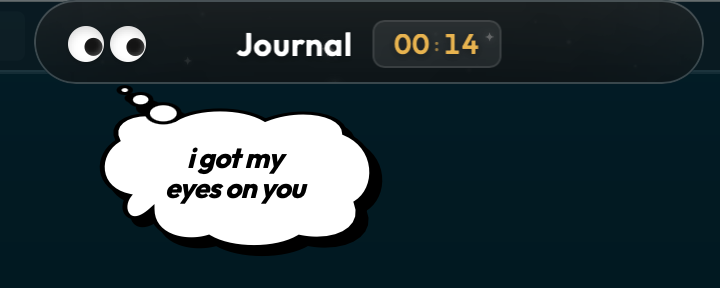
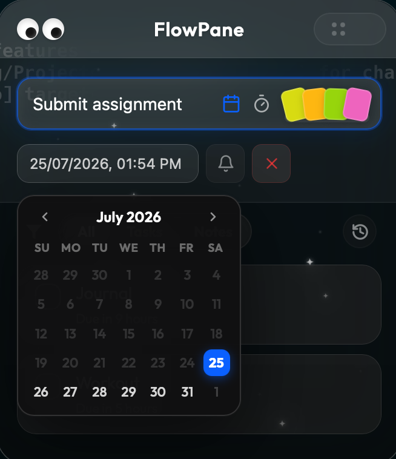
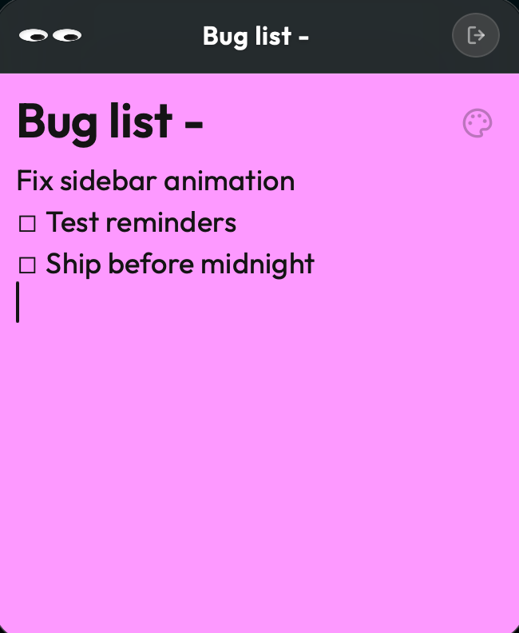
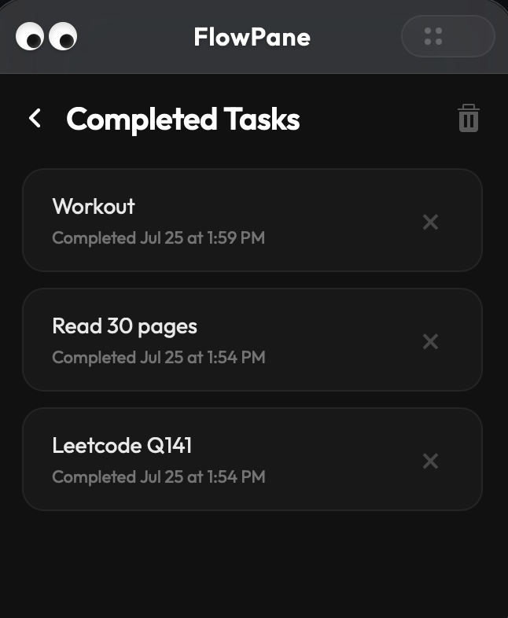

<div align="center">


# FlowPane

**A translucent, always-on-top task manager that lives at the edge of your screen.**

[](https://github.com/rkhooda/FlowPane/releases)
[](https://github.com/rkhooda/FlowPane/releases)
[](LICENSE)
[](https://v2.tauri.app)
[](PRIVACY_POLICY.md)

[Download](#installation) · [Features](#features) · [Screenshots](#screenshots) · [Build from Source](#build-from-source)

</div>

---

> FlowPane sits quietly at the edge of your screen — snap it away when you need focus, pull it back when you need your list. No accounts, no cloud, no distractions.

---

## Screenshots

| Task List | Focus Mode | Edge Collapsed |
|:---------:|:----------:|:--------------:|
|  |  |  |

| Due Date Picker | Notes | Completed Tasks |
|:--------------:|:-----:|:---------------:|
|  |  |  |

---

## Features

### Always There, Never in the Way
FlowPane is a frameless, transparent window that floats above all your other apps. Drag it to any screen edge and it snaps and collapses into a slim sliver — hover over the edge to peek at your list without interrupting your flow.

### Tasks
- **Quick capture** — type a task name and hit Enter
- **Due dates** — pick a date from a mini calendar and set a time with the inline time picker
- **Time presets** — attach a countdown of `+15m`, `+30m`, or `+1h` directly to a task
- **Reminders** — get notified 30 min, 1 hr, 1 day before a deadline — or set a custom interval
- **Urgency states** — overdue tasks are highlighted automatically
- **Task history** — completed tasks are archived and restorable

### Focus Mode
Lock in on a single task. FlowPane shows only what matters — the task name, a live timer, and a rotating motivational quote. Set a countdown or just run the stopwatch. When the timer ends, a "Time's Up" prompt asks if you're done.

### Notes
Create freeform notes alongside your tasks. Pick an accent color from the built-in color wheel or preset palette, give the note a title, and write freely. Notes live in the same list as tasks and can be filtered independently.

### Filter & History
Switch between **All**, **Tasks**, and **Notes** views. Completed tasks collect in a History view where you can restore them or clear the archive.

### System Tray
FlowPane runs quietly in your menu bar. Right-click the tray icon to show the window or quit — no Dock icon needed.

### Private by Design
Everything stays on your machine. No accounts, no sync, no analytics. Tasks and notes are saved to a local JSON file via [`tauri-plugin-store`](https://github.com/tauri-apps/tauri-plugin-store).

---

## Installation

### macOS

1. Download `FlowPane_x.x.x_aarch64.dmg` from the [Releases](https://github.com/rkhooda/FlowPane/releases) page.
2. Open the `.dmg` and drag **FlowPane** to your Applications folder.
3. On first launch, right-click the app and choose **Open** to bypass the Gatekeeper prompt (unsigned build).

> **Requires macOS 12.0 or later.**

---

## Keyboard Shortcuts

| Shortcut | Action |
|----------|--------|
| `Enter` | Add task (from the task input) |
| `Esc` | Exit focus mode / close note / dismiss modal |
| Right-click | Open context menu (About, Privacy, Quit) |

---

## Build from Source

### Prerequisites

- [Node.js](https://nodejs.org) + npm
- [Rust toolchain](https://rustup.rs) (`rustup`, `cargo`)
- [Tauri prerequisites](https://v2.tauri.app/start/prerequisites/) for your OS

### Run in development

```bash
npm install
npm run tauri dev
```

### Production build

```bash
npm run tauri build
```

The `.app` and `.dmg` will be output to `src-tauri/target/release/bundle/`.

---

## Project Structure

```
FlowPane/
├── src/
│   ├── index.html          # App layout and UI
│   ├── styles.css          # Visual design and interaction states
│   ├── js/
│   │   └── main.js         # App logic (tasks, focus mode, notes, window behavior)
│   └── assets/             # Icons and images
├── src-tauri/
│   ├── src/
│   │   ├── main.rs         # Rust binary entry point
│   │   └── lib.rs          # Tauri setup, IPC commands, tray, event bridge
│   ├── tauri.conf.json     # Window and bundle configuration
│   └── Cargo.toml          # Rust dependencies
└── package.json
```

---

## Tech Stack

| Layer | Technology |
|-------|-----------|
| Desktop runtime | [Tauri 2](https://v2.tauri.app) |
| Backend logic | Rust |
| Frontend | Vanilla HTML, CSS, JavaScript — no framework, no bundler |
| Storage | [`@tauri-apps/plugin-store`](https://github.com/tauri-apps/tauri-plugin-store) |

---

## Privacy

FlowPane collects no data. All tasks and notes are stored locally on your device and never transmitted anywhere. See [PRIVACY_POLICY.md](PRIVACY_POLICY.md) for the full policy.

---

## License

[MIT](LICENSE) — © 2026 FlowPane Team
